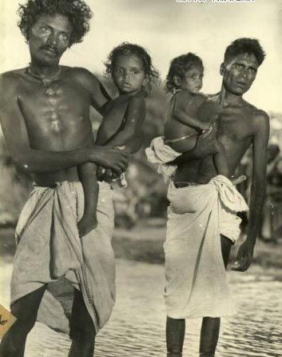
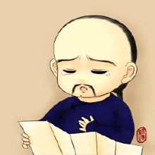
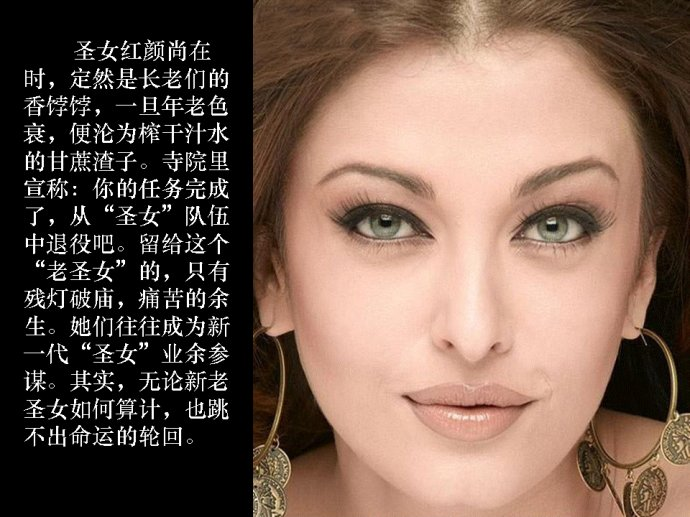
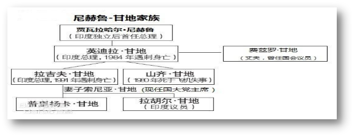

title: MAO
author:
  name: red flag team|Lance
output: map.html
controls: true
theme: sudodoki/reveal-cleaver-theme
--
#关于印度种姓制度
##及
#人是否平等的见解
`国旗标小组`
--
#一、印度的种姓制度
印度种姓制度源于印度教，又称瓦尔纳制度，是在后期吠陀时代形成的，具有3000多年历史。这一制度将人分为4个等级，即婆罗门、刹帝利、吠舍和首陀罗。
--
-  印度种姓制度源于印度教，又称瓦尔纳制度，是在后期吠陀时代形成的，具有3000多年历史。这一制度将人分为4个等级，即婆罗门、刹帝利、吠舍和首陀罗.
- 它是古代世界最典型、最森严的等级制度。
- 四个等级在地位、权利、职业、义务等方面有严格的规定：

--
| 等级 | 名称 | 职业 |
|--------|--------|
| 第一等级 | 婆罗门 | 掌管宗教祭祀，享有崇高地位 |
| 第二等级 | 刹帝利 | 充当武士，掌管军，政大权 |
| 第三等级 | 吠舍 | 是一般平民，以农，牧，工，商为职业。多数人无政治权利 |
| 第四等级 | 首陀罗 | 是被征服的土著居民和沦落的雅利安人，主要从事低贱的职业 |
--
### 除四大种姓外，还有一种被排除在种姓外的人，即所谓“不可接受的贱民”，又称“达利特”。

--
- 他们社会地位最低，最受歧视。种姓世袭，不易更改。社会地位高低、经济状况好坏，大多与种姓有关。尽管印度独立以来，已废除种姓制度，但几千年来种姓制度造成的种姓歧视在印度不少地区、尤其是农村仍相当严重。
--
###中国网名的见解

* 1 在印度人中，贱民是不洁的，看一眼都不行，贱民生活用“很惨”来形容，他们没有存在感
* 2 贱民没有工作权利，大部分印度家庭都是脏的，后来才知，印度人认为打扫是低贱的，因此一般都由贱民打扫，又因打扫工具落后，所以不干净.等见解
--
#印度贱民的由来及状况
--
- 印度的贱民（Dalit，英译Untouchable），多由罪犯、战俘或是跨种姓婚姻者及其后裔组成。因为他们的身份世代相传，不能受教育、不可穿鞋、也几乎没有社会地位，只被允许从事非常卑贱的工作，例如清洁秽物或丧葬

- 由于“贱民”被视为不可接触的人，因此四个瓦尔那的人严禁触碰到其他贱民的身体，贱民走过的足迹都要清理抚平，甚至连影子都不可以交叠，以免玷污他人
- 由于贱民毫无社会地位，因此至今印度仍然经常发生贱民因不慎接触到四个瓦尔那的人而被殴打甚至杀害的事件，而这些动手之人甚至不必负起任何法律责任。
--
###印度种姓制度对现今印度的影响
 *=============>*主要从生活中女性地位及政治上论述
- 在生活上：最大的影响在于对女性的不尊重，尤其是贱民女性，例如近年来的黑公交事件以及之前的14、15岁贱民姐妹遭奸杀后吊于树上的新闻，以及印度圣女.
--
#印度圣女:
- 源自印度的一项古老的传统来自贫困家庭女孩进入青春期后，就被迫卖身于寺院，成为印度教高级僧侣和婆罗门长老的性奴隶，因此被称为“圣女”。由于不清洁的性生活，印度圣女已成为艾滋病的高发人群。
--

--
###在政治上
- 印度的政治特点（也为甘地家族从政奠定基础）种姓制度对政治影响较大。种姓是一种森严的等级制度，
- 其每个中心集团因其地位高低依婆罗门、刹帝利、吠舍首陀罗顺序排列。种姓的礼仪地位同政治地位有很大的一致性，种姓和权力之间有很大的关联性。政治权力的分配是由多方面的因素决定的，其中确定一个具体的种姓集团究竟属于哪一个种姓是至关重要的。
--
#最大的例子
#甘地家族
#从政史

--
- 尼赫鲁·甘  地家族的祖先是克什米尔富裕的婆罗门，历来享有崇高的社会地位。家族中不乏精通梵文、法律和印度教教义的贤哲。
- 尼赫鲁·甘地家族出了尼赫鲁、英迪拉和拉吉夫三任总理，长期统治印度独立后的政界。
- 尼赫鲁·甘地家族的名字还是“圣雄’甘地的功劳：当时，尼赫鲁是北印度的婆罗门出身，而独生女英迪拉却与异教拜火教的教徒结婚，新婚夫妻的姓氏成为问题，于是“圣雄”甘地给了他们“甘地”的姓。
--

- 然而尼赫鲁·甘地家族也是一个悲剧频发的家族，英迪拉和儿子拉吉夫先后被暗杀，而拉吉夫的弟弟桑贾伊在飞机失事中遇难。现在拉吉夫34岁的儿子拉胡尔·甘地又当选印度人民院议员，像他的祖辈、父辈一样，又开始投身于印度的政坛。
- 以上为我们的相关见解
--
##关于平等问题
###通过一定的讨论，我们认为人不平等理由：
- [ ]在当代中国，不平等的存在可围绕“钱”、“权”两方面
- [ ]二、我国是一个历史悠久的大国，历史上长期发展的相关意识形态对我们思想的影响。
- [ ] 三、当代中国发展不完善、人们的总体素质明显不高。
--
#END
--